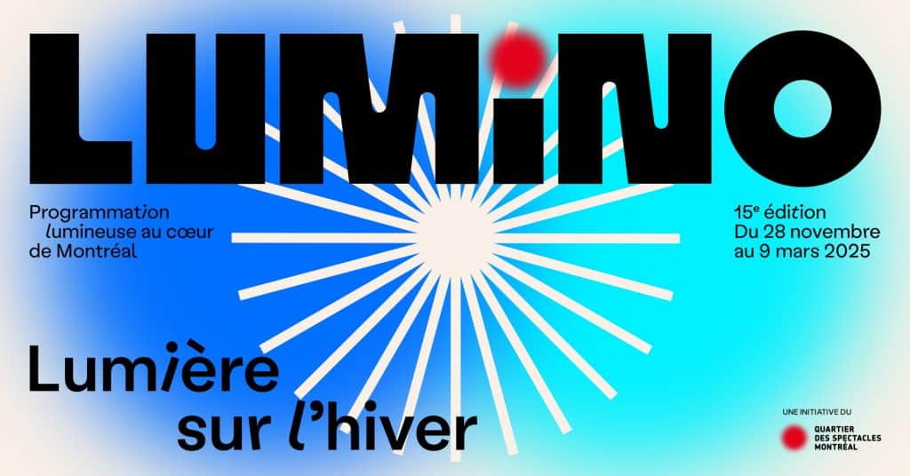
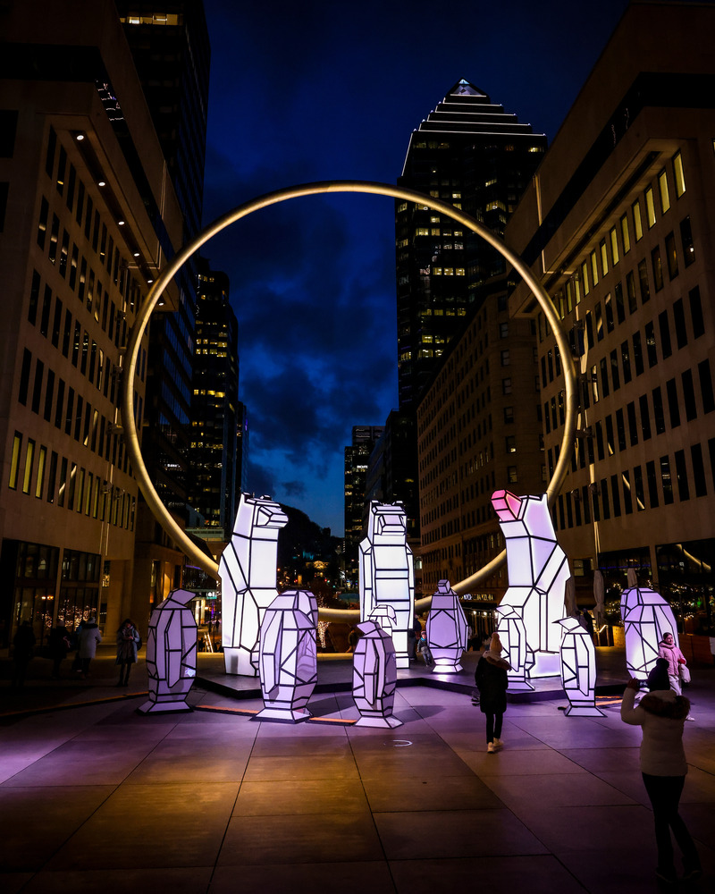

# Exposition: LUMINO

Lumino est une exposition temporaire qui se déroulait du 1er décembre 2024 au 10 mars 2025 à l'Esplanade PVM de la Place Ville Marie.

# Oeuvre: Cercle Polaire

Le 20 février 2025 je suis allée visité l'oeuvre Cercle polaire. Le concept de l'oeuvre est crée par M.A.D mais elle a été dessiné par Jason Carter.

 

## Fonction du dispositif
Le Cercle polaire est une oeuvre interractive. En tournant la manivelle, les différents animaux prennent de différente couleur et font chacun leur bruit respectif. Je pense honnêtement que les haut-parleurs pour les bruits d'animaux étaient dans les grandes statues puisqu'ils n'étaient pas visible de l'extérieur.
<table align="center">
<tr>
<td></td>
<td></td>
<td></td>
<td></td>
</tr>
</table>

## Composantes et techniques

 
(image prise sur le site de Lumino)
 
Liste de composante: 7 statues de manchots, 3 statues d'ours, fils, dispositif intéractif avec la manivelle.
 
Éléments nécessaire à la mise en exposition: cache-fil
