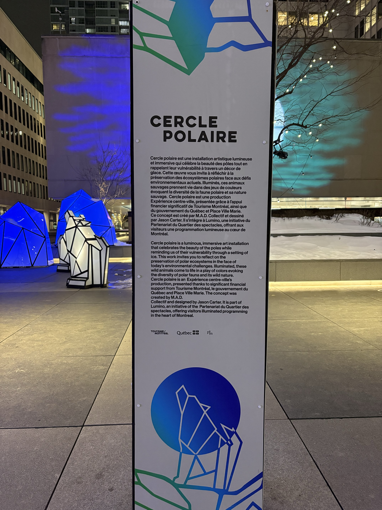

# Exposition: LUMINO

Lumino est une exposition temporaire qui se déroulait du 1er décembre 2024 au 10 mars 2025 à l'Esplanade PVM de la Place Ville Marie.

# Oeuvre: Cercle Polaire

Le 20 février 2025 je suis allée visité l'oeuvre Cercle polaire. Le concept de l'oeuvre est crée par M.A.D mais elle a été dessiné par Jason Carter.

