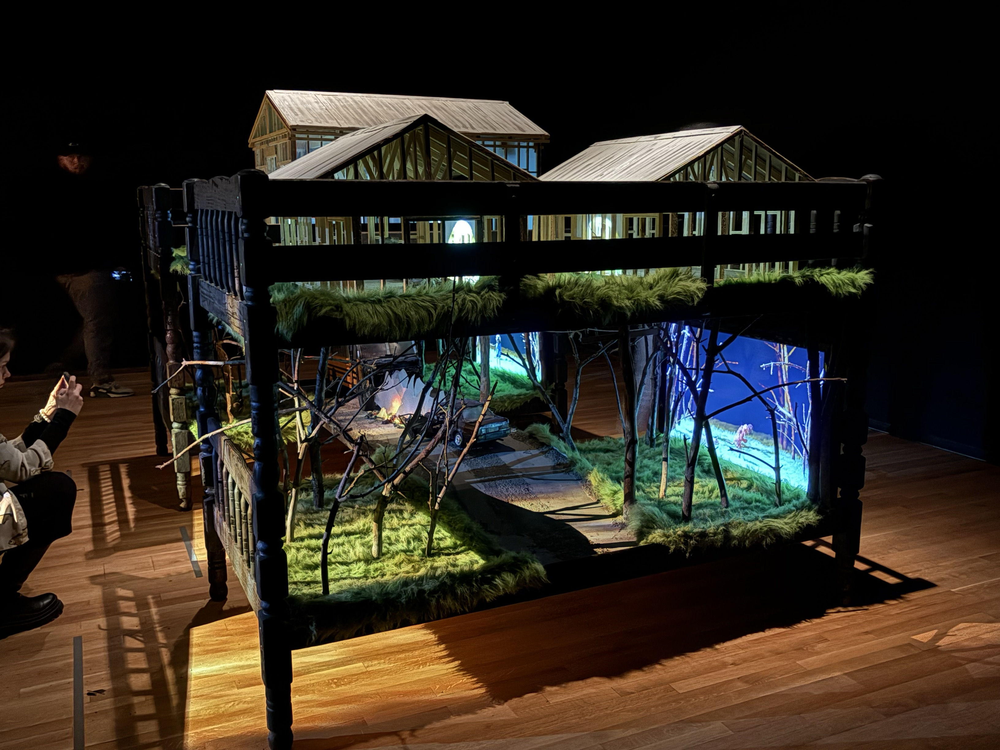
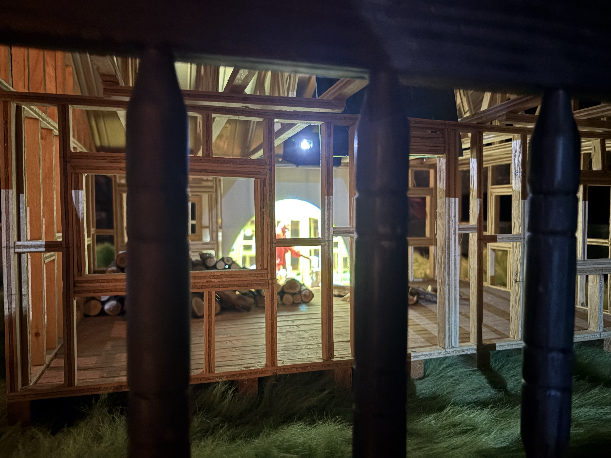
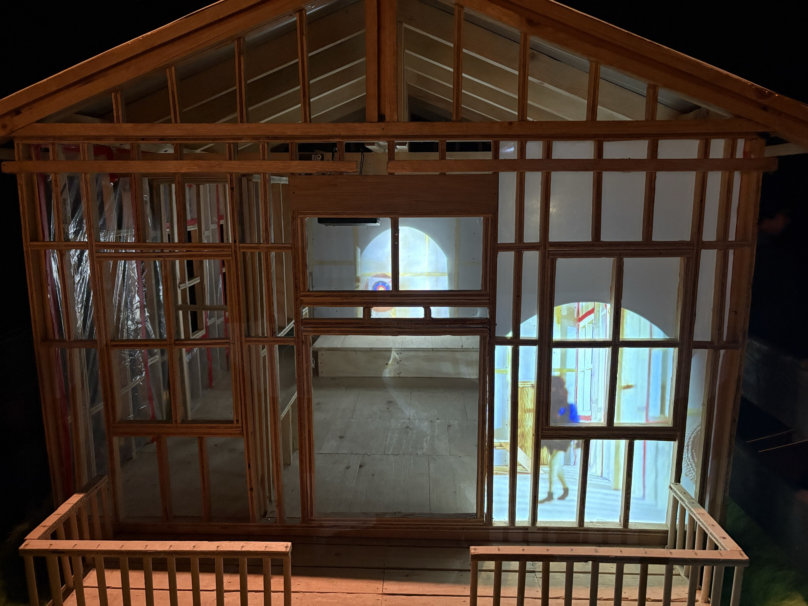

# ART CONTEMPORAIN

L'exposition d'art contemporain est une exposition permanente au musée des beaux arts de Montréal, qui se situe au Pavillon Jean-Noël Desmarais. 

# Camp Wakonda
Le vendredi 4 avril 2025 nous sommes allé voir l'oeuvre comtemplative "Camp Wakonda" crée en 2013 par l'artiste canadien Graeme Patterson.

L'oeuvre est composé de deux lit superposé mit l'un à coté de l'autre. Sur le dessus de ces lit se trouve deux petites maison en bois, où l'on peut observé différents personnages animés à l'aide de projecteur et d'une toile blanche pour chancun d'eux. Sur la partie inférieure des lits se trouve deux télévision qui diffusent chacune des personnages différents: 

### 1- Vue d'ensemble de l'oeuvre

### 2- Maison sur le dessus des lits

