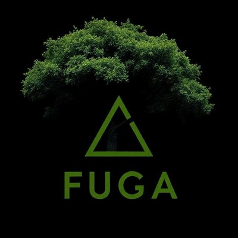

## Orde des projets

# 1. Con-Du8

#### Équipe : 
<table align="center">
<tr>
<td></td>
<td></td>
<td></td>
<td></td>
<td></td>
</tr>
<tr>
<td>Ian Corbin</td>
<td>Alexandre Gervais</td>
<td>Jeremy Roy-Coté</td>
<td>Keven Malric</td>
<td>Samuel Desmeubles-Voyer</td>
</tr>
</table>

#### Installation finale :

#### Schéma :

<table align="center">
<tr>
<td></td>
<td></td>
<td></td>
</tr>
</table>

( Les images de l'installation finale et du schéma proviennent du Github du projet Con-Du8 )

#### Commentaire :

Cette installation était parfaite pour dépenser son énergie. C'était simple à utiliser et l'ajout du ventilateur était une très bonne idée pour amplifier l'immersion.

#### Liste des cours utile :

# 2. Luminatura

#### Équipe :
<table align="center">
<tr>
<td></td>
<td></td>
<td></td>
<td></td>
<td></td>
</tr>
<tr>
<td>Audrey</td>
<td>Camilia</td>
<td>Ihab</td>
<td>Justine</td>
<td>Prethiah</td>
</tr>
</table>

#### Installation finale :

#### Schéma :

<table align="center">
<tr>
<td></td>
<td></td>
<td></td>
</tr>
</table>

( Les images de l'installation finale et du schéma proviennent du Github du projet Luminatura )

#### Commentaire :

Les couleurs étaient très jolies et le mélange avec le son lorsqu'on promène nos doigts sur les plaques en acier apportait vraiment une expérience relaxante. De plus, le fait que les fleurs étaient présente physiquement donnait un bel effet de superposition et comme si les lumières coulaient réellement de celles-ci.

# 3. Internature

#### Équipe :

<table align="center">
<tr>
<td></td>
<td></td>
<td></td>
<td></td>
<td></td>
</tr>
<tr>
<td>Kenza El Harrif</td>
<td>Sitmonternna Yi</td>
<td>Khaly Tia Sing</td>
<td>Isaac Fafard</td>
<td>Delphine Grenier</td>
</tr>
</table>

#### Installation finale :

#### Schéma :

<table align="center">
<tr>
<td></td>
<td></td>
<td></td>
</tr>
</table>

( Les images de l'installation finale et du schéma proviennent du Github du projet Internature )

#### Commentaire :

C'était tres intéressant de voir les plantes et fleurs grandir au fur et a mesure qu'on tournait la boule au milieux du tunel. C'était également agréable de pouvoir les faire bouger en passant sa main sur le tissus.

#### Cours utiles :

# 4. Prismatica

#### Équipe :

<table align="center">
<tr>
<td></td>
<td></td>
<td></td>
</tr>
<tr>
<td>Jérémy Duverseau</td>
<td>Vincent Delisle</td>
<td>Ikrame Rata</td>
</tr>
</table>

#### Installation finale :

#### Schéma :

<table align="center">
<tr>
<td></td>
<td></td>
</tr>
</table>

( Les images de l'installation finale et du schéma proviennent du Github du projet Prismatica )

#### Commentaire :

Une belle expérience de pouvoir voir son dessin a l'écran avec un trait de crayon différent. Le son était aussi agréable et rajoutait plus d'ambiance et d'intéraction.

# 5. Arcadia

#### Équipe :

<table align="center">
<tr>
<td></td>
<td></td>
<td></td>
</tr>
<tr>
<td>Dominic Yale</td>
<td>Alexandre Gervais</td>
<td>Anton Nikulin</td>
</tr>
</table>

#### Installation finale :

#### Schéma :

<table align="center">
<tr>
<td></td>
<td></td>
<td></td>
<td></td>
</tr>
</table>

( Les images de l'installation finale et du schéma proviennent du Github du projet Arcadia )

#### Commentaire :
Tres belle ambiance de jeu. Les graphique etaient vraiment jolie et le parcour etait une bonne idee. L'emplacement des parchemin n'etait pas trop evidente ( ce qui est une bonne chose ) et le fait de devoir comprendre qu'il y avait un double saut etait aussi tres bien penser ( montrer plutot que de dire ).

# 6. Etheria

#### Équipe :
<table align="center">
<tr>
<td></td>
<td></td>
<td></td>
<td></td>
<td></td>
</tr>
<tr>
<td>Joshua Gonzalez-Barrera</td>
<td>Victor Gileau</td>
<td>Michael Un Dupré</td>
<td>Pierre-Luc Proulx</td>
<td>Maik Hamel</td>
</tr>
</table>

#### Installation finale : 

#### Schema :

<table align="center">
<tr>
<td></td>
<td></td>
</tr>
</table>

#### Commentaire :
Juste un peu confuse sur le role des personnages dans le jeu mais sinon le principe de "Tower defense" etait bien amusant et la maniere dont on controllait les personnages etait aussi tres creative.

# 7. Fuga

#### Équipe :

<table align="center">
<tr>
<td></td>
<td></td>
<td></td>
<td></td>
<td></td>
</tr>
<tr>
<td>Matis</td>
<td>Tristan</td>
<td>Daniel</td>
<td>Abdel</td>
<td>Yavuz</td>
</tr>
</table>
