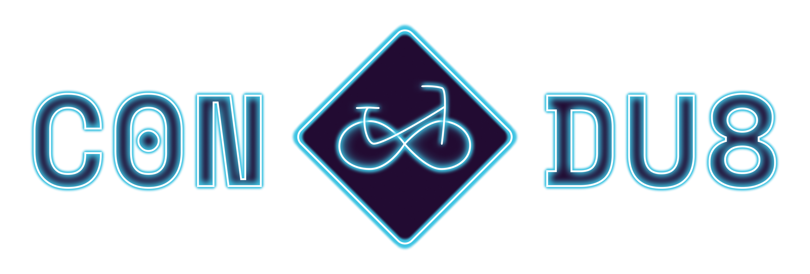
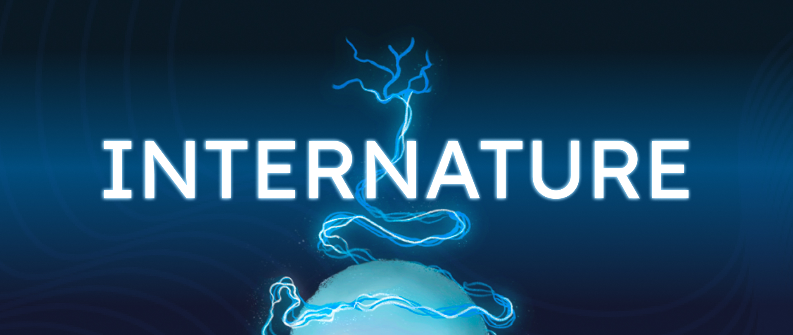
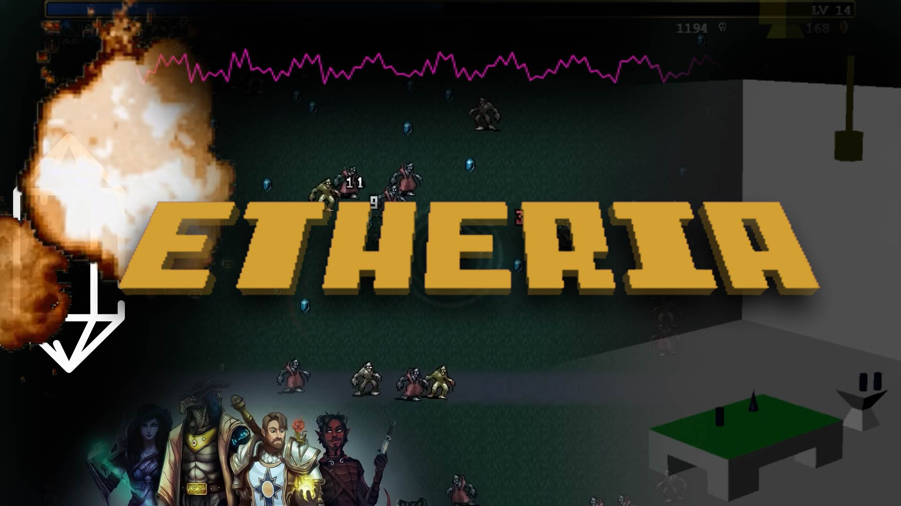

## Orde des projets

## 1. Con-Du8

#### Équipe : 
<table align="center">
<tr>
<td></td>
<td></td>
<td></td>
<td></td>
<td></td>
</tr>
<tr>
<td>Ian Corbin</td>
<td>Alexandre Gervais</td>
<td>Jeremy Roy-Coté</td>
<td>Keven Malric</td>
<td>Samuel Desmeubles-Voyer</td>
</tr>
</table>

## 2. Luminatura

#### Équipe :
<table align="center">
<tr>
<td></td>
<td></td>
<td></td>
<td></td>
<td></td>
</tr>
<tr>
<td>Audrey</td>
<td>Camilia</td>
<td>Ihab</td>
<td>Justine</td>
<td>Prethiah</td>
</tr>
</table>

## 3. Internature

#### Équipe :

<table align="center">
<tr>
<td></td>
<td></td>
<td></td>
<td></td>
<td></td>
</tr>
<tr>
<td>Kenza El Harrif</td>
<td>Sitmonternna Yi</td>
<td>Khaly Tia Sing</td>
<td>Isaac Fafard</td>
<td>Delphine Grenier</td>
</tr>
</table>

## 4. Prismatica

#### Équipe :

<table align="center">
<tr>
<td></td>
<td></td>
<td></td>
</tr>
<tr>
<td>Jérémy Duverseau</td>
<td>Vincent Delisle</td>
<td>Ikrame Rata</td>
</tr>
</table>

## 5. Arcadia

#### Équipe :

<table align="center">
<tr>
<td></td>
<td></td>
<td></td>
</tr>
<tr>
<td>Dominic Yale</td>
<td>Alexandre Gervais</td>
<td>Anton Nikulin</td>
</tr>
</table>

## 6. Etheria

#### Équipe :
<table align="center">
<tr>
<td></td>
<td></td>
<td></td>
<td></td>
<td></td>
</tr>
<tr>
<td>Joshua Gonzalez-Barrera</td>
<td>Victor Gileau</td>
<td>Michael Un Dupré</td>
<td>Pierre-Luc Proulx</td>
<td>Maik Hamel</td>
</tr>
</table>

## 7. Fuga

#### Équipe :

<table align="center">
<tr>
<td></td>
<td></td>
<td></td>
<td></td>
<td></td>
</tr>
<tr>
<td>Matis</td>
<td>Tristan</td>
<td>Daniel</td>
<td>Abdel</td>
<td>Yavuz</td>
</tr>
</table>
