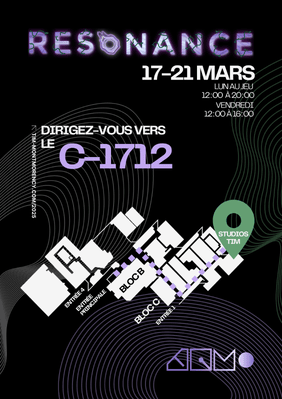
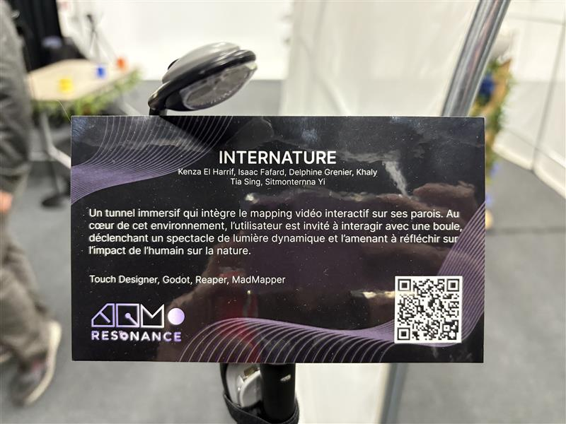

# Visite des projets des finissants
 
### Nom de l'exposition:

### Lieu de mise en exposition : 
Local C-1712 Collège Montmorency

### Type d'exposition :
Exposition temporaire

 
### Date de visite :

L'exposition se déroule du 17 au 21 mars 2025.

Lundi au Jeudi: De 12H à 20H

Vendredi: De 12H à 16H

### Titre du dispositif choisi : 
Le titre du dispositif est C0n-Du8

### Nom des artistes : 
<table align="center">
<tr>
<td></td>
<td></td>
<td></td>
<td></td>
<td></td>
</tr>
<tr>
<td>Khaly Tia Sing</td>
<td>Isaac Fafard</td>
<td>Delphine Grenier</td>
<td>Sitmontemna Yi</td>
<td>Kenza El Harrif</td>
</tr>
</table>

### Description du dispositif : 

### Type d'installation : 
Internature est une installation intéractive.

### Mise en espace :
![photo]( 

### Composition et technique :

 
### Ce qui vous a plu, vous a donné des idées?

 
### Aspect que vous ne souhaiteriez pas retenir pour vos propres créations ou que vous feriez autrement	

 
