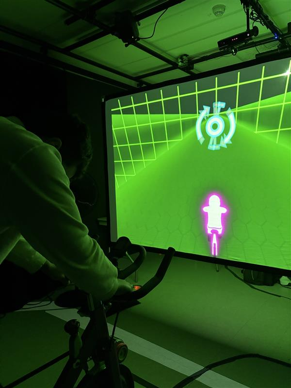

# Visite des projets des finissants
 
### Nom de l'exposition:

### Lieu de mise en exposition : 
Local C-1712 Collège Montmorency

### Type d'exposition :
Exposition temporaire

 
### Date de visite :

L'exposition se déroule du 17 au 21 mars 2025.

Lundi au Jeudi: De 12H à 20H

Vendredi: De 12H à 16H

<h2>Titre du dispositif choisi :</h2> 
Le titre du dispositif est C0n-Du8

### Équipe : 
<table align="center">
<tr>
<td></td>
<td></td>
<td></td>
<td></td>
<td></td>
</tr>
<tr>
<td>Ian Corbin</td>
<td>Alexandre Gervais</td>
<td>Jeremy Roy-Coté</td>
<td>Keven Malric</td>
<td>Samuel Desmeubles-Voyer</td>
</tr>
</table>

### Description du dispositif : 

### Type d'installation : 
C0n-Du8 est une installation intéractive. Le vélo permet de faire avancer le personnage à l'écran. Le but étant de gagner la course d'endurance.

### Mise en espace :

### Composition et technique :

![photo](media/

 
### Ce qui vous a plu, vous a donné des idées?

J'ai beaucoup aimé le fait que c'était une interraction plus physique. De plus, le fait que le vélo est aussi dans le jeu, ça rajoute vraiment un bon effet d'immersion. On a vraiment l'impression d'être dans le jeu et de courser contre les autres.
 
### Aspect que vous ne souhaiteriez pas retenir pour vos propres créations ou que vous feriez autrement	

 
