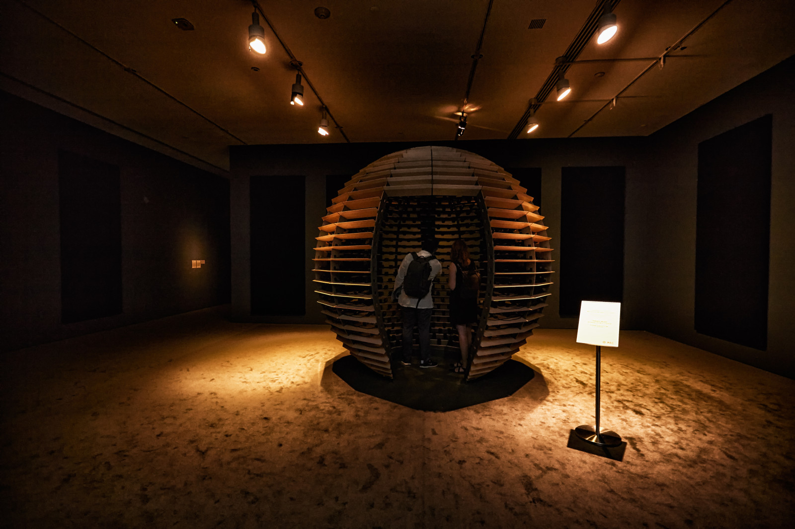

# Antimodular Studio

### Jade Séguéla

Ce studio mes en expositon les oeuvres de  Rafael Lozano Hammer. Jade Séguéla, sa régistraire, s'occupe de l'installation des oeuvres au studio, ainsi que leur importation et exportation. Par exemple, lors de la vie d'une oeuvre, s'il y a une opportunité de la diffuser, elle devra s'occuper de l'entreposer jusqu'à l'exposition. Ensuite viendra la gestion du transport, de l'installation sur place et de la désinstallation après la durée de l'exposition. Si l'oeuvre n'a pas d'autre chance d'être diffusé, Jade devra alors l'entreposée jusqu'à sa prochaine occasion d'exposition. Lors de la conférence, elle présente le travail de Lozano Hammer et la conception de ses oeuvres.

### Rafael Lozano Hammer

Lozano hammer est un artiste mexicain né en 1967. La particularté la plus importante de ses oeuvres est qu'elles sont interactives. Ce n'est pas comme des tableaux ou des sculptures, s'il n'y a pas de plublique, il n'y a pas d'oeuvre. Pour que l'oeuvre soit complète, deux types d'interactivité doivent avoir lieux; l'interactivité passive et active. L'interactivité passive regroupe les choses que nous faisons naturellement sans même l'oeuvre devant nous comme regarder, marcher et respirer. Tandit que, l'interactivité active son des comportement qui seront initié suite à l'expérimentation de l'oeuvre comme parler, swiper ou appuyer sur un bouton. C'est deux interactivités combinées génèreront donc une émotion qui donneront vie à l'oeuvre.

### Sphere Packing: Bach

(Cette image provient du site URBANIA)

Cette oeuvre est une sphère en bois et en aluminium, incorporant de 1 128 haut-parleurs, chacun jouant une composition différente de Johann Sebastian Bach. Au début, le son commence doucement et tranquillement tout les haut-parleurs finissent par jouer en même temps. Chaque haut-parleur est doté d'une petite lumière indiquant lesquels fonctionnent. De temps en temps, durant la durée de l'oeuvre, les haut-parleur cèdent la place à une pièce en particulier. L'avoir expérimenté en 2018 au Musée d'Art Contemporain de Montréal, malgré tout les sons qui jouent en simultané, l'oeuvre est très agréable à vivre et n'est pas dutout désagréable contrairement à ce que certains pourraient croire.
